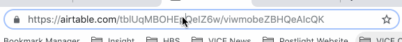

# Airtable-as-CMS

Airtable-as-CMS is a nifty tool that lets you create a static website from an Airtable table and style it with custom CSS.

## Table of Contents

1. [Getting Started](#getting-started)
   - [Installing Yarn](#installing-yarn)
   - [Environment setup](#environment-setup)
   - [How to find your environment variables](#how-to-find-your-environment-variables)
2. [Setting up your Airtable base](#setting-up-your-airtable-base)
   - [Metadata table](#metadata-table)
   - [Hiding fields](#hiding-fields)
   - [Supported field types](#supported-field-types)
3. [Development](#development)
4. [Build](#build)
5. [Styling](#styling)
   - [Default classes](#default-classes)
6. [Custom renderers](#custom-renderers)

## Getting Started

### Installing Yarn

This project uses [Yarn](https://yarnpkg.com) to download and manage copies of the third party code we used to build it. If you already have Yarn installed, you can skip to the next section. Otherwise, you can follow the instructions [here](https://yarnpkg.com/lang/en/docs/install/#mac-stable) to install it for macOS or [here](https://yarnpkg.com/lang/en/docs/install/#windows-stable) to install it for Windows.

If you're a Mac user, you may want to install Homebrew if you haven't already. Homebrew is a package manager that will allow you to easily download, install, and manage software such as Yarn. You can follow the instructions on [the Homebrew website]((https://brew.sh/) or you can install it from the command line by:

1. Opening up a terminal window via the "Terminal" application
2. Copy and pasting the following into the terminal window and hitting Enter/Return

```
/usr/bin/ruby -e "$(curl -fsSL https://raw.githubusercontent.com/Homebrew/install/master/install)"
```

After the installation completes, you can then open a new terminal window (Cmd+T works) and run `brew install yarn` to install Yarn.

When that's done, open up another terminal window and run `yarn install`. This will download the 3rd party code this project needs in order to work.

### Environment setup

This project uses environment variables to store credentials such as your Airtable API key, so we'll need to set those up before we can move onto more exciting things. Luckily this is pretty simple: all you have to do is create a file called `.env` in the root directory of this project and populate it with your values. Head to the [.env.example](./.env.example) file to get an idea of what your `.env` file should look like (feel free to copy and paste!). Make sure to replace the values after each equal sign `=` with your own value (we'll cover how to find your values next).

#### How to find your environment variables

Here, we'll talk about where you need to go to find the environment variables this project needs to run. All of them can be found by going to the right place on the Airtable website.

**AIRTABLE_API_KEY**:

For this one, head to [your Airtable account page](https://www.airtable.com/account). From there, find the `API` section and click the `Generate API key` button if you haven't previously generated a key. Copy and paste the key as-is into your `.env` file so that it looks something like `AIRTABLE_API_KEY=keyBKHVUZpvdE25DY`, with your own key replacing that fake one.

If you don't know what an API key is, it's basically a way to let Airtable know that _you_ know this project is going to use data from your Airtable base to create a website. This is a way to keep your data safe from being accessed by unauthorized users.

**BASE_ID**: To find this one, let's first go to your Airtable base on the Airtable site. Look at the URL in your browser—it should look something like `https://airtable.com/tblUqMOHEpQeIZ6w/viwmobeZBQeAIcQK`. You can see two blobs of letters and numbers. The _first_ blob is your `BASE_ID`. Here's a gif to help you out:



**TABLE_ID**: This is just the name of the table in your Airtable base that you want to turn into a website. If the name contains multiple words, be sure to surround it in quotation marks (" ") in the `.env` file, so the entry looks like
`TABLE_ID="your table name"`

**VIEW**: This is just the name of the view in your table that you want to turn into a website. If the name contains multiple words, be sure to surround it in quotation marks (" ") in the `.env` file, so the entry looks like `VIEW="your view name"`. This one's optional! The default view will be used if you don't specify a different one here.

**FIELD_ORDER**: This one's up to you! Put your base's column names in the order you would like for them to appear on the page. This should be a comma-separated list like `FIELD_ORDER="Field 1, Field 2, Field 3"`. (The commas are important!)

## Setting up your Airtable base

### Metadata table

Some features of this project will only work if you add a metadata table to your base. This required table must be named `_Metadata`. It consists of a single row with specifically named columns and uses the values of these columns to add an extra layer of customization to your site. The supported fields are the following:

**SiteTitle**: This field allows you to set the site title, which will appear in the `<head>` tag of the site's HTML and will be visible in the browser tab that the site is open in.

**Favicon**: This attachment field allows you to add a [favicon](https://en.wikipedia.org/wiki/Favicon) for your site. To make use of it, upload a PNG, JPG or GIF file that is 16x16 or 32x32 pixels in size.

**HomepageHiddenFields**: This field allows you to designate fields to be hidden in the homepage view. For example, you may want to keep the `Body` field of a blog post from showing up on the homepage because it would make the homepage quite long. The value of this field should be a comma-seperated list of the fields you wish to hide, e.g. "Body, Description, Author".

**HeaderTitle**: This field allows you to add a title that will be added to your site as a header. This will most likely be the name of your site, but can be whatever you want.

Head to [this site](https://airtable.com/shr7AykJUZ0qgkt1l/tblhTiXpKbVacXpbQ) if you'd like to see an example of how this table should look.

Note: _The `_Metadata` table is required._

### Hiding fields

Sometimes you'll find you have fields in your base that you don't necessarily want shown on your site. In this case, you can prepend an underscore (\_) to the field name and it won't be added into the site's HTML. For example, if you don't want to show the `SensitiveInfo` field, simply rename it `_SensitiveInfo` and it won't be included in the site.

### Supported field types

This project currently supports most but not all Airtable field types. The only field types it doesn't currently support are "Link to another record", "Barcode", and "Collaborator".

## Development

Entering `yarn run start:dev` into a terminal window will fire up a server that will allow you to view your site and style it in real time. By default, it will run at `localhost:8080`—just put that in your browser's URL bar and you'll be able to see your site. Each time you save after editing CSS or custom renderers, your work will be automatically reflected in the browser.

## Build

Running `yarn build` in a terminal window will execute a build script that will generate your site. The generated site will live in the `/dist` folder.

## Styling

Any CSS put in the `main.css` file at `/custom/main.css` will be injected into your site for styling purposes.

Your field names will always be added as classes in the corresponding HTML. So for example, a field called "Title" will generate an HTML element with the class `.Title`. There are other classes that are put in by default detailed below. You can make use of these classes to style the site to your liking.

### Default classes

`.attachments`: placed on attachment-type fields
`.field-name`: placed on the element containing the name of each field
`.field-value`: placed on the element containing the value of each field
`.row-link`: placed on each row on the homepage
`.row`: placed on each row
`.header`: placed on the header
`.index-page` placed on an element that wraps the homepage

## Custom renderers

To add a custom renderer for one of your fields, create a React component that accepts `name` and `value` as props in the `/custom/renderers` folder, then import and export it in `custom/renderers/index.js`. The name of the file and component must match the name of the column you would like it to serve as renderer for. If the name of your column includes spaces, do not include the spaces in the name of the corresponding file and component. So a custom renderer for a column called "Body Text" should be a React component called `BodyText` in a file called `custom/renderers/BodyText.js` and exported from `custom/renderers/index.js` as such.
